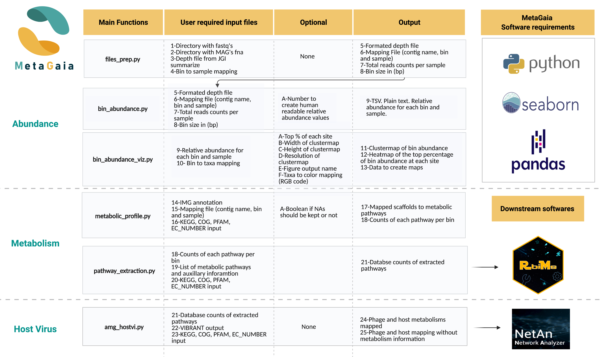

```{r knitr setup, include=FALSE,  eval=TRUE, echo=FALSE, warning=FALSE}
library(knitr)
knitr::opts_chunk$set(eval=TRUE, cache=FALSE, message=FALSE, warning=FALSE, 
                      comment = "", results="markup")
```

# About MetaGaia

MetaGaia is a pipeline that streamlines the process of calculating bin abundances, identifying the metabolic pathways present in each bin, and the metabolic pathways found in both phages and their hosts. The importance of performing each of these functions is to better understand microbial communities and the dominant microbes present within a community. This pipeline is divided into three sections that perform different functions: 1) Calculating bin abundances (abundance), 2) Identifying metabolic pathways present in each bin (metabolism), and 3) Finding commonalities between phages and their hosts (host-virus). Multiple requirements are needed and are specified in the "Requirements" section of this protocol.



# MetaGaia installation 

The MetaGaia software is available as an open-source package distributed from a GitHub repository. Thus,
the natural way of installing it is by cloning the repository via the following commands:
```{bash, eval=FALSE}
git clone https://github.com/valdeanda/MetaGaia
```

# Requirements

*NOTE: Please do NOT use symbolic links for fastq or fna files.*

## Calculating bin abundances (abundance)

1. All necessary fastq files have been downloaded and placed within the same directory.
2. All necessary fna files have been downloaded and placed within the same directory.
3. All necessary depth text files have been downloaded and placed within the same directory or a concatenated depth file has already been created.
4. A file has been created that maps each bin to its respective sample name (see "Mapping bins to samples" for more information).
5. The GTDBTK tool has been downloaded to map each bin to its respective taxa (see "Mapping taxa" for more information).

## Identifying metabolic pathways (metabolism)

1. The `mapping_file.tsv` file created from the "bin_abundance" section of the pipeline.
2. An account at the Integrated Microbial Genomes with Microbiome Samples system [IMG](https://img.jgi.doe.gov/) is needed with the IMG annotation of all of the samples being analyzed.
3. File to combine annotation files. (What is this file?)
4. A user created file that contains the KEGG, COG, PFAM, and/or EC_NUMBER pathways of interest.

## Finding commonalities between phages and their hosts (host-virus)

1. The "database_counts" file from the `merge_databases.py` script that contains only one of the following databases: KEGG, COG, PFAM, or EC_NUMBER.
2. The output from Vibrant that maps phage scaffolds to metabolic pathways.

# Running abundance

## Creating bin abundance input files

1. To create all the input files necessary, run the `files_prep.py` script. Two input files (concatenated `depth` file is optional) are necessary and the directories where the `fastq` and `fna ` (and optional `depth`) files are located are needed to run this script (see "Download fastqs" for more information on where to obtain these). One of the depth arguments must be present: depth or depth_dir. These are the arguments necessary to run this script:

```{bash, eval=FALSE}
usage: files_prep.py [-h] -b BIN_SAMPLES [-d DEPTH] [-f DEPTH_DIR] -q
                     FASTQ_DIR -a FNA_DIR

optional arguments:
  -h, --help            show this help message and exit
  -b BIN_SAMPLES, --bin_samples BIN_SAMPLES
                        Input file containing 2 columns: 1st column contains
                        bin names and 2nd column contains sample names.
                        Requires header for each column, "Bin" and "Sample"
                        respectively. File must have tsv or csv file
                        extension.
  -d DEPTH, --depth DEPTH
                        Input file containing 5 columns: contigName,
                        contigLen, totalAvgDepth, Sample_Depth, and Depth.
                        This file can be created with
                        jgi_summarize_bam_contig_depths. File must have tsv or
                        csv file extension.
  -f DEPTH_DIR, --depth_dir DEPTH_DIR
                        Input directory path containing all the depth txt
                        files that must be concatenated.
  -q FASTQ_DIR, --fastq_dir FASTQ_DIR
                        Input directory path containing all the fasta files.
  -a FNA_DIR, --fna_dir FNA_DIR
                        Input directory path containing all the fna files.
```

Example of concatenated depth file:

```{bash, eval=FALSE}
contigName              contigLen   totalAvgDepth         Sample_Depth                    Depth
S4B_scaffold_41967_c1   2430.0      15.7917               SF_May12_USGS_4_1-sorted.bam    15.7917
S4B_scaffold_22085_c1   3249.0      12.081                SF_May12_USGS_4_1-sorted.bam    12.081
S4B_scaffold_39665_c1   2489.0      9.998289999999999     SF_May12_USGS_4_1-sorted.bam    9.998289999999999
S4B_scaffold_36461_c1   2583.0      8.70695               SF_May12_USGS_4_1-sorted.bam    8.70695
S4B_scaffold_62858_c1   2036.0      11.1448               SF_May12_USGS_4_1-sorted.bam    11.1448
S4B_scaffold_47653_c1   2298.0      10.1196               SF_May12_USGS_4_1-sorted.bam    10.1196
S4B_scaffold_28262_c1   2900.0      8.95927               SF_May12_USGS_4_1-sorted.bam    8.95927
```

To create the `bin_sample` file, read the "Mapping bins to samples" section below. To create the `depth` file, read the "Create initial depth file" section below as well.

Example of bin_sample file:

```{bash, eval=FALSE}
Bin                 Sample
NoBin               S1A
13_Jan_SF_Bin44     S1A
14_Jan_SF_Bin36     S2B
21_Jan_SF_Bin21     S3B
24_Jan_SF_Bin43     S1A
```

Here is an example of how to run this script:

```{bash, eval=FALSE}
python3 files_prep.py -b bin2sample.tsv -d depth.tsv -q ~/fastq_files/ -a ~/fna_files/
```

2. There should be four files named "reads_file.tsv", "mapping_file.tsv", "depth_file", and "binsize_file.tsv" saved in the `output` folder.

## Calculate relative bin abundance

1. The `bin_abundance.py` script then takes in a list of input files (processed from by running the `files_prep.py` script) that need to be created beforehand. Here are the descriptions of each of the input files:

```{bash, eval=FALSE}
usage: bin_abundance.py [-h] -r READS -m MAPPING -d DEPTH -s BINSIZE
                        [-n READABLENUM]

optional arguments:
  -h, --help            show this help message and exit
  -r READS, --reads READS
                        Total number of reads. Rows are samples column are
                        reads
  -m MAPPING, --mapping MAPPING
                        Tabular file containingOriginal_Contig_Name Bin Sample
  -d DEPTH, --depth DEPTH
                        Tabular file depth infoOriginal_Contig_Name contigLen
                        Saple_Depth Depth
  -s BINSIZE, --binsize BINSIZE
                        Tabular file with Bin and corresponding Genome size
                        (bp) as columns
  -n READABLENUM, --readablenum READABLENUM
                        A large number to multiply the relative abundances so
                        that it is human readable.
```

Here is an example of how to run the script (using example data provided in the `data` folder): 
```{bash, eval=FALSE}
python3 bin_abundance.py -r ../../data/example_input_files/example__reads.tsv -m ../../data/example_input_files/example__mapping.tsv -d ../../data/example_input_files/example__depth.tsv -s ../../data/example_input_files/example__size.tsv -n 1000000
```

2. The output will be a file saved in the `output` directory. This file can then be used in the next script: `bin_abundance_viz.py` to visualize the data.

## Visualize relative bin abundance

1. With the `bin_abundance_viz.py` script, the files outputted from `bin_abundance.py` can be used to visualize the relative bin abundances in addition to a file mapping each bin to their respective taxa (see "Mapping taxa" for more information). These are the arguments needed for the visualization script:

```{bash, eval=FALSE}
usage: bin_abundance_viz.py [-h] -b BIN_ABUNDANCE -t TAXONOMY_INFO [-p PERCENT] [-w WIDTH] [-l HEIGHT] [-d DPI] [-o OUT_FIG] [-c TAXA_COLOR]

optional arguments:
  -h, --help            show this help message and exit
  -b BIN_ABUNDANCE, --bin_abundance BIN_ABUNDANCE
                        Input file outputted from the bin_abundance.py script with file extension.
  -t TAXONOMY_INFO, --taxonomy_info TAXONOMY_INFO
                        Input file mapping taxonomy to each bin with file extension.
  -p PERCENT, --percent PERCENT
                        Percent of highest sample in each bin [10].
  -w WIDTH, --width WIDTH
                        Width of outputted clustermap figure [4].
  -l HEIGHT, --height HEIGHT
                        Height of outputted clustermap figure [5].
  -d DPI, --dpi DPI     Resolution for output figure file [300].
  -o OUT_FIG, --out_fig OUT_FIG
                        Stores the figure in the specified file path and format [test.png].
  -c TAXA_COLOR, --taxa_color TAXA_COLOR
                        Input file containing the RGB color code for each taxa with file extension [""].
```  

Example of bin_abundance file:

```{bash, eval=FALSE}
Bin             Sample  RelativeAbundance       RelativeAbundanceReadable
AB_1215_Bin_45  AB_3033 4.30188348833424e-12    0.00043018834883342403
AB_1215_Bin_149 AB_3033 1.2259111326544231e-11  0.0012259111326544231
AB_1215_Bin_125 AB_3033 4.08691276142096e-12    0.000408691276142096
AB_1215_Bin_136 AB_3033 1.3190975129266425e-12  0.00013190975129266424
```

Example of taxonomy_info file:

```{bash, eval=FALSE}
Bin             Taxa
13_Jan_SF_Bin36 Pacearchaeota
13_Jan_SF_Bin40 Thaumarchaeota_Nitrosopumilus
13_Jan_SF_Bin52 Thaumarchaeota_Nitrosopumilus
13_Jan_SF_Bin61 Thermoplasmata
```

Example of taxa_color file:

```{bash, eval=FALSE}
#a3c1ad
#ede4d9
#426ca6 
#ffdab9
#fff5e5
#ffefd5
```

Here is an example of how to run this script:

```{bash, eval=FALSE}
python3 bin_abundance_viz.py -b ../output/bin_abundance_output.tsv -t ~/tax2bin.tsv -p 10 -w 8 -l 5 -d 500 -o figure1.jpg -c ~/tax2color.tsv
```

2. Outputs will be saved in the `output` directory containing the user-specified name.

# Running metabolism

*NOTE: The only metabolic pathways that are available to analyze are in the KEGG, COG, PFAM, and EC_NUMBER databases.*

## Map metabolic pathways to the scaffold containing them and get the counts of each pathway per bin

1. One requirement must be met before running the `metabolic_profile.py` script, which is that the IMG annotation files must be combined into one (see "Creating IMG annotation" for more information).

2. To get the pathways mapped to each scaffold and the number of times each pathway is found within a bin, run the `metabolic_profile.py` script. These are the arguments for this script:

```{bash, highlight=TRUE, eval=FALSE}
usage: metabolic_profile.py [-h] -i IMGANNO -m MAPPING -d DATABASE
                            [-c CONSISTENCY]

optional arguments:
  -h, --help            show this help message and exit
  -i IMGANNO, --imganno IMGANNO
                        Input file in tsv format. Rows are genes columns are
                        IMG annotations.
  -m MAPPING, --mapping MAPPING
                        A tsv file containing original contig name, sample,
                        and bin columns. Created from the files_prep.py
                        script.
  -d DATABASE, --database DATABASE
                        Database(s) of interest to merge together. Input as a
                        list.
  -c CONSISTENCY, --consistency CONSISTENCY
                        Boolean value that determines if scaffolds not
                        containing a value for each database should be kept.
                        Leave blank if consistency check is not needed.
```

Example of imganno file:

```{bash, eval=FALSE}
Original_Contig_Name    IMG_Contig_Name Locus_Tag       IMG_Gene_ID     Gene_Type       Gene_Start      Gene_Stop       Gene_Length     Homolog_Gene_ID Homolog_Taxon_ID        Lineage_%ID     Lineag
S1A_scaffold_1_c2       Ga0224507_10000001      Ga0224507_100000011     Ga0224507_10000001.1    CDS     2       805     803     641316135       641228499       65.06   Archaea;Thaumarchaeota;unclass
S1A_scaffold_1_c2       Ga0224507_10000001      Ga0224507_100000012     Ga0224507_10000001.3    CDS     943     1254    311     2518759324      2518645532      79.61   Archaea;Thaumarchaeota;unclass
S1A_scaffold_1_c2       Ga0224507_10000001      Ga0224507_100000013     Ga0224507_10000001.5    CDS     1243    1911    668     2518890842      2518645576      82.81   Archaea;Thaumarchaeota;unclass
S1A_scaffold_1_c2       Ga0224507_10000001      Ga0224507_100000014     Ga0224507_10000001.7    CDS     1945    3255    1310    641316132       641228499       88.97   Archaea;Thaumarchaeota;unclass
S1A_scaffold_1_c2       Ga0224507_10000001      Ga0224507_100000015     Ga0224507_10000001.9    CDS     3248    3595    347     2518890840      2518645576      72.17   Archaea;Thaumarchaeota;unclass
```

Example of mapping file:

```{bash, eval=FALSE}
Original_Contig_Name    Bin     Sample
S1A_scaffold_1000000_c1 NoBin   S1A
S1A_scaffold_1000001_c1 NoBin   S1A
S1A_scaffold_1000002_c1 NoBin   S1A
S1A_scaffold_1000003_c1 NoBin   S1As
```

Here is an example of how to run this script:

```{bash, highlight=TRUE, eval=FALSE}
python3 metabolic_profile.py -i imgannotation.tsv -m ../../../output/mapping_file.tsv -d [KEGG, COG, PFAM, EC_NUMBER] -c True
```

2. Outputs will be saved in the `output` directory containing name formats: "mapped_scaffolds.tsv" and the database name followed by "metabolic_profile.tsv".

## Optional step: Merge databases into one file

*This step is optional if the user has multiple databases that they need to merge into one file for the next step.*

1. To merge each of the databases, run the `merge_database.py` script. These are the arguments for the script:

```{bash, eval=FALSE}
usage: merge_databases.py [-h] -p DATABASES_PATH -d DATABASE

optional arguments:
  -h, --help            show this help message and exit
  -p DATABASES_PATH, --databases_path DATABASES_PATH
                        Path for directory containing all the database files.
  -d DATABASE, --database DATABASE
                        Database(s) of interest to merge together. Input as a
                        list.
```

Here is an example of how to run this script:

```{bash,eval=FALSE}
python3 merge_database.py -p ../../../output/ -d [KEGG, COG, PFAM, EC_NUMBER]
```

2. Outputs will be places in the `output` directory containing the name formats: "merged_" database name "_metabolic_profile.tsv" and "final_merged_metabolic_profile.tsv".

## Extract specific pathways to analyze

1. One requirement must be met to run the `pathway_extraction.py` script, which is that the user-defined database must be created (see "Defining metabolic database" for more information).

2. To extract and analyze specific metabolic pathways, run the `pathway_extraction.py` script. These are the arguments for the script:

```{bash,eval=FALSE}
usage: pathway_extraction.py [-h] -c CUSTOMDATA -p PATHWAY_DATABASE -d
                             DATABASE

optional arguments:
  -h, --help            show this help message and exit
  -c CUSTOMDATA, --customdata CUSTOMDATA
                        Input file in tsv format with at least one column with
                        the header containing the pathways of interest.
  -p PATHWAY_DATABASE, --pathway_database PATHWAY_DATABASE
                        Input file in tsv format that contains the counts of
                        each pathways per bin.
  -d DATABASE, --database DATABASE
                        Database(s) of interest to merge together. Input as a
                        list.
```

Example of customdata file (can have other descriptive columns if needed):

```{bash,eval=FALSE}
Pathway    Subpathway   KEGG    COG      PFAM     Description
Nitrogen   Annamox      K20932  COG3391  PF18582  K20932; hydrazine synthase subunit [EC:1.7.2.7]
Nitrogen   Annamox      K20933  COG1858           K20933; hydrazine synthase subunit [EC:1.7.2.7]
Nitrogen   Annamox      K20934  COG0823           K20934; hydrazine synthase subunit [EC:1.7.2.7]
Nitrogen   Annamox      K20935                    hdh; hydrazine dehydrogenase [EC:1.7.2.8]
```

Example of pathway_database file:

```{bash,eval=FALSE}
KEGG        13_Jan_SF_Bin1  13_Jan_SF_Bin10  13_Jan_SF_Bin12  13_Jan_SF_Bin13  13_Jan_SF_Bin14  13_Jan_SF_Bin2  13_Jan_SF_Bin21
KO:K00001   0.0             0.0              0.0              0.0              0.0              0.0             0.0     
KO:K00002   1.0             0.0              0.0              0.0              0.0              0.0             0.0     
KO:K00003   2.0             0.0              1.0              1.0              0.0              0.0             1.0    
KO:K00004   0.0             0.0              0.0              0.0              0.0              0.0             0.0     
KO:K00005   0.0             0.0              0.0              0.0              0.0              0.0             0.0     
KO:K00006   0.0             0.0              0.0              0.0              0.0              0.0             0.0     
KO:K00008   0.0             0.0              0.0              0.0              0.0              0.0             0.0 
```

Here is an example of how to run this script:

```{bash, eval=FALSE}
python3 pathway_extraction.py -c user-defined_database.tsv -p ../../../output/final_merged_metabolic_profile.tsv -d [KEGG, COG, PFAM, EC_NUMBER]
```

3. Outputs will be places in the `output` directory containing the name "extracted_pathways.tsv".

# Running host-virus

## Compare phage and host metabolisms to identify commonalities

1. There are two requirements needed to run this script: 1) the "database_counts" file outputted using the `merge_databases.py` script from the "metabolism" portion of this pipeline and 2) the Vibrant output file mapping scaffolds to metabolic pathways.

2. To analyze the unique and shared metabolic pathways between the two organisms, run the `amg_hostvi.py` script. These are the arguments for the script:

```{bash,eval=FALSE}
usage: amg_hostvi.py [-h] -p PATHWAY_DATABASE -v VIBRANT_OUTOUT -d
                               DATABASE

optional arguments:
  -h, --help            show this help message and exit
  -p PATHWAY_DATABASE, --pathway_database PATHWAY_DATABASE
                        Input file in tsv format that contains the counts of
                        each pathways per bin.
  -v VIBRANT_OUTOUT, --vibrant_outout VIBRANT_OUTOUT
                        Input file from Vibrant in tsv format that contains
                        phage scaffolds mapped to metabolic pathways.
  -d DATABASE, --database DATABASE
                        Input only one of the following database names the
                        user is interested in analyzing: KEGG, COG, PFAM, or
                        EC_NUMBER.
```

Example of pathway_database file:

```{bash,eval=FALSE}
KEGG        13_Jan_SF_Bin1  13_Jan_SF_Bin10  13_Jan_SF_Bin12  13_Jan_SF_Bin13  13_Jan_SF_Bin14  13_Jan_SF_Bin2  13_Jan_SF_Bin21
KO:K00001   0.0             0.0              0.0              0.0              0.0              0.0             0.0     
KO:K00002   1.0             0.0              0.0              0.0              0.0              0.0             0.0     
KO:K00003   2.0             0.0              1.0              1.0              0.0              0.0             1.0    
KO:K00004   0.0             0.0              0.0              0.0              0.0              0.0             0.0     
KO:K00005   0.0             0.0              0.0              0.0              0.0              0.0             0.0     
KO:K00006   0.0             0.0              0.0              0.0              0.0              0.0             0.0     
KO:K00008   0.0             0.0              0.0              0.0              0.0              0.0             0.0     
```

Example of vibrant_output file

```{bash,eval=FALSE}
protein             scaffold        AMG KO   AMG KO name                                            Pfam         Pfam name
scaffold_1527_10    scaffold_1527   K03639   "moaA, CNX2; GTP 3',8-cyclase [EC:4.1.99.22]"          PF04055.21   Radical SAM superfamily
scaffold_1527_19    scaffold_1527   K01939   "purA, ADSS; adenylosuccinate synthase [EC:6.3.4.4]"   PF00709.21   Adenylosuccinate synthetase
scaffold_224_117    scaffold_224    K01939   "purA, ADSS; adenylosuccinate synthase [EC:6.3.4.4]"   PF00709.21   Adenylosuccinate synthetase
scaffold_224_158    scaffold_224    K22227   "ahbD; heme synthase"                                  PF13186.6    Iron-sulfur cluster-binding domain
```

Here is an example of how to run this script:

```{bash,eval=FALSE}
python3 amg_hostvi.py -p ../../output/KEGG_database_counts.tsv -v ~/vibrant_output.tsv -d KEGG
```

3. Outputs will be places in the `output` directory containing the names "phage_host_metabolism.tsv" and "phage_host_mapping.tsv".

# Additional commands

## Download fastqs

Follow the download instructions found on [IMG](https://genome.jgi.doe.gov/portal/help/download.jsf#/api).

## Mapping bins to samples

The user must manually map each bin to its respective sample.

## Create initial depth file

The script, `jgi_summarize_bam_contig_depths.pl`, must be used to create the depth file needed in `files_prep.py` and can be found [here](https://bitbucket.org/berkeleylab/metabat/src/master/) along with its usage notes.

Here is an example command to run this sccript:

```{bash, eval=FALSE}
jgi_summarize_bam_contig_depths --percentIdentity 97 --outputDepth ../../assembly_metaspades_cat_renamed_3kb_cov --referenceFasta ../../data/assembly_metaspades_cat_renamed_3kb.fasta ../../read_mapping/metaspades_cat_renamed_3kb/assembly_metaspades_cat_renamed_3kb_D*.coordsort.bam
```

## Mapping taxa

One way to map each the taxa to each bin is to use the GTDBTK tool found here: https://github.com/Ecogenomics/GTDBTk.

## Creating IMG annotation

First, log on to the IMG server found [here](https://genome.jgi.doe.gov/portal/help/download.jsf#/api). Then, download and unzip the tar.gz file. Once you have the IMG annotation files, run the `consolidateJGIdata.pl` script to consolidate the data obtained from JGI IMG into one file. The script can be found [here](https://github.com/Geo-omics/scripts).

## Defining metabolic database

When creating a user-defined database, there are multiple format requirements. The metabolic databases of interest should contain one or multiple headers (KEGG, COG, PFAM, EC_NUMBER) depending on which database the user wants to analyze. All other auxiliary columns will be mapped to the bins and added to the final outputted file. Lastly, in each of the database columns, please format each pathway name as it is in the IMG annotation file:

```{bash,eval=FALSE}
KEGG - KO:K12345
COG - COG12345
PFAM - pfam12345
EC_NUMBER - EC:EC12345
```
## Creating Vibrant mapping

I need help with this.

# Support and Development

This pipeline has been developed by the Baker lab at UT Austin. If there are any questions, comments, or concerns, please email us at either sahilbshah@berkeley.edu or valdeanda@utexas.edu.
 
# Cite 
If you find this software useful please cite us as: 

Coming soon!

